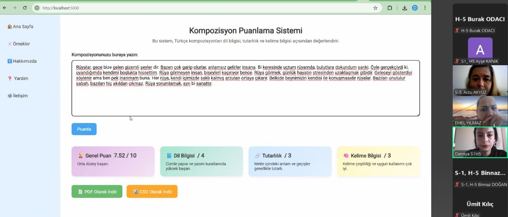
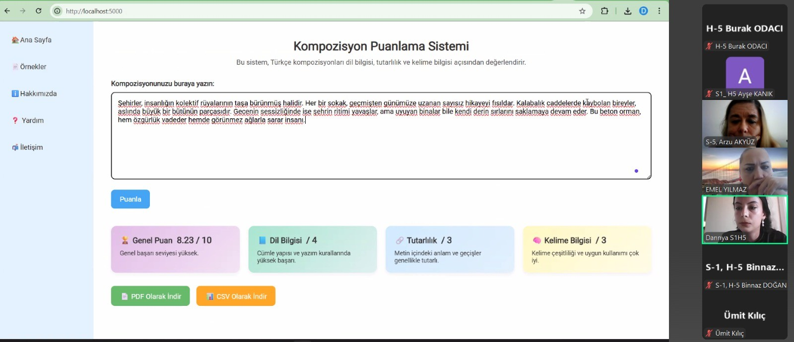

# 🇹🇷 BERTTurk TABANLI Türkçe Kompozisyon Değerlendirme Sistem AKADEMİK BİLDİRİ| 🇬🇧 BERTTurk based Turkish Essay Scoring (AES) CONFERENCE PAPER

ARCENG IV. INTERNATIONAL ANKARA SCIENTIFIC STUDIES CONFERENCE
August 08-10, 2025, Ankara, Türkiye

Projemiz, Türkçe yazılmış kompozisyonları **dil bilgisi, tutarlılık ve kelime bilgisi** kriterlerine göre değerlendiren yapay zekâ tabanlı bir sistemdir.  
Amaç; eğitim kurumları, öğretmenler, öğrenciler ve içerik üreticileri için Türkçe metinlerin hızlı, nesnel ve tutarlı biçimde puanlanmasını sağlamaktır.

This project is an AI-based system that evaluates Turkish-written essays according to **grammar, coherence, and vocabulary** criteria.  
The goal is to provide fast, objective, and consistent scoring of Turkish texts for educational institutions, teachers, students, and content creators.

---

## Demo Versiyonu Hakkında | About the Demo Version
- Şu anda sistem **farklı kaynaktan toplanmış, yaklaşık 550 kompozisyon** ile eğitilmiştir.  
- Kompozisyonlar **Gemini** tarafından 3 ölçüte göre (dil bilgisi, tutarlılık, kelime bilgisi) puanlanmıştır ve **demo versiyonunda BERTTurk model egitimi için sadece toplam puanlar kullanılmıştır**.  
- Gelecekte:  
  - Uzmanlarca manuel puanlanmış kompozisyonlar da eklenecek,  
  - Eğitim 3 ölçüte göre yapılacak,  
  - Sonuçta toplam puan ayrı ayrı hesaplanarak daha tutarlı bir model elde edilecektir.
 
- Currently, the system has been trained with approximately 550 essays collected from various sources.
- The essays were scored by Gemini based on three criteria (grammar, coherence, and vocabulary), and only the total scores were used for BERTTurk model training in the demo version.
- In the future:
- Essays manually scored by experts will also be added.
- Training will be conducted based on three criteria.
- Ultimately, the total score will be calculated separately, resulting in a more consistent model.

---

## Özellikler | Features 
- BERTurk (bert-base-turkish-cased) tabanlı dil modeli  
  Based on the BERTurk (bert-base-turkish-cased) language model   
- Toplam skor (0–10) üzerinden değerlendirme | Evaluates on Overall score (0–10)
- Flask tabanlı web arayüzü | Flask-based web interface 
  
## Hedeflenen Özellikler | Planned Features 
- Çoklu görev öğrenme (multi-task learning) yaklaşımı  
  Multi-task learning approach  
- Üç ölçüt üzerinden değerlendirme | Evaluates on three criteria:
  - Dil bilgisi / Grammar (0–4)
  - Tutarlılık / Coherence (0–3)
  - Kelime bilgisi / Vocabulary (0–3)
- Toplam skor (0–10) | Overall score (0–10)    

---

## Veri Seti | Dataset
- Farklı kaynaklardan toplanan Türkçe kompozisyonlar (~550 adet, Gemini tarafından puanlandı)  
  Turkish essays collected from multiple sources (~550, scored by Gemini)  

---

## Gelecek Çalışmalar | Future Work
- Uzmanlarca puanlanmış kompozisyonlarla yeniden eğitim  
  Retraining with essays scored by human experts  
- Çoklu dil desteği (İngilizce, Almanca vb.)  
  Multilingual support (English, German, etc.)  
- Otomatik dil bilgisi düzeltme önerileri  
  Automatic grammar correction suggestions  
- Öğretmenler için sınıf bazlı analiz modülleri  
  Classroom-level analytics modules for teachers  

---

## 📑 Proje Özeti | Project Abstract
🇹🇷  
Projemizde Türkçe yazılmış kompozisyonları dil bilgisi, tutarlılık ve kelime bilgisi gibi kriterlere göre değerlendiren yapay zeka tabanlı bir sistem tanıtılmaktadır. Geliştirilen sistem, eğitim kurumları, öğretmenler, öğrenciler ve içerik üreticileri için Türkçe metinlerin hızlı, nesnel ve tutarlı biçimde puanlanmasını sağlayarak eğitim teknolojileri alanına yenilikçi bir katkı sunmaktadır.  
Mevcut demo versiyon, Gemini tarafından puanlanmış yaklaşık 550 kompozisyon ile toplam puan üzerinden eğitilmiştir. Gelecekte uzman puanlamaları eklenerek sistemin güvenilirliği artırılacak, ayrıca eğitim üç ölçüt üzerinden yapılarak toplam puan sonradan hesaplanacaktır.  

🇬🇧  
Our project introduces an artificial intelligence-based system that evaluates Turkish-written essays according to criteria such as grammar, coherence, and vocabulary. The developed system provides a fast, objective, and consistent scoring of Turkish texts for educational institutions, teachers, students, and content creators, thereby offering an innovative contribution to the field of educational technologies.  
The current demo version is trained with approximately 550 essays scored by Gemini, using only overall scores. In the future, expert manual scoring will be added, and training will be performed based on the three separate criteria, with the overall score calculated afterward for improved reliability.  

---

## Arayüz Görselleri | Interface Screenshots

-   
-   
